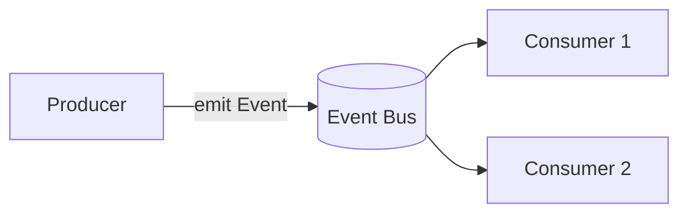

# Research: Obsidian PKM 系统与插件生态调研（为新 CC plugin 提供设计参考）

- **Query**: 主流 Obsidian 知识库插件 / PKM workflow 调研
- **Scope**: external (PKM 方法论、Obsidian 插件) + internal（已有 CC plugin 参考实现）
- **Date**: 2026-05-10
- **Source repos referenced**:
  - `claude-obsidian-marketplace` (AgriciDaniel/claude-obsidian @ v1.6.0) — 本地路径 `/Users/luoxin/.claude/plugins/marketplaces/claude-obsidian-marketplace/`
  - `omob/oh-my-obsidian` (hongdangmoo49/oh-my-obsidian) — 本地路径 `/Users/luoxin/.claude/plugins/marketplaces/omob/plugins/oh-my-obsidian/`
  - `obsidian-skills` (Anthropic 官方 obsidian skill bundle) — 本地路径 `/Users/luoxin/.claude/plugins/marketplaces/obsidian-skills/`

---

## A. 主流 PKM 方法论

| 方法 | 核心目录约定 | 命名 / metadata | 适用场景 | 来源 |
|---|---|---|---|---|
| **Zettelkasten** (Niklas Luhmann) | 单一扁平笔记池，靠 link 而非目录 | unique-id (yyyymmddhhmm) + 简短 title；每篇单一原子概念 | 长期累积思考 | https://zettelkasten.de/posts/overview/ ；Sönke Ahrens《How to Take Smart Notes》 |
| **LYT (Linking Your Thinking)** (Nick Milo) | `+ Maps/`（MOC = Map of Content）+ `Notes/` + `Sources/` + `Spaces/` | MOC 作为 hub，frontmatter `up:` 指上层 MOC；标签轻用 | 中型 vault，强结构化但不死板 | https://www.linkingyourthinking.com/ ；LYT Kit 仓库 |
| **PARA** (Tiago Forte) | `01 Projects / 02 Areas / 03 Resources / 04 Archives` 4 顶层目录 | 按"行动距离"组织而非主题；frontmatter `status` | 任务驱动、多角色 | 《Building a Second Brain》；https://fortelabs.com/blog/para/ |
| **Johnny.Decimal** | `10-19 Cat / 11.01 Item` 数字编址 | 严格 2 级 + 4 位 ID；`10-19/11/11.01 Topic.md` | 团队协作、长期稳定 | https://johnnydecimal.com/ |
| **Evergreen Notes** (Andy Matuschak) | 概念命名为"完整断言句" (`Evergreen notes should be atomic.md`) | 标题即断言；每篇可独立阅读；无标签强迫 | 写作输出导向 | https://notes.andymatuschak.org/Evergreen_notes |

**实务结合**：claude-obsidian 实际采用的是 LYT + Evergreen 杂交：`wiki/concepts/`、`wiki/entities/`、`wiki/sources/`、`wiki/comparisons/`、`wiki/questions/`、`wiki/folds/`、`wiki/meta/`、`wiki/canvases/`，加 `index.md`、`hot.md`、`log.md`、`overview.md` 在根（见 `claude-obsidian-marketplace/wiki/`）。这个布局规避了 PARA 的"项目耦合"问题，又比 Zettelkasten 扁平池更可导航。

**通用 frontmatter schema**（claude-obsidian `_templates/concept.md`）：

```yaml
type: concept | entity | source | comparison | question | meta | fold
title: ""
aliases: []
created: YYYY-MM-DD
updated: YYYY-MM-DD
tags: [concept]
status: seed | developing | mature | stale
related: []
sources: []
```

---

## B. 主流插件生态：能力定位

| 插件 | 能力 | CC plugin 关系 |
|---|---|---|
| **Dataview** (blacksmithgu/obsidian-dataview) | SQL/JS 查询 markdown frontmatter 渲染表格/列表/任务 | **共生**：CC 写出符合 Dataview 查询的 frontmatter，让 dashboard 在 Obsidian 内动态刷新（典型示例：`TABLE status, updated FROM "wiki/concepts" WHERE status != "stale"`）。CC 不要自己重做查询。 |
| **Templater** (SilentVoid13/Templater) | 模板 + JS 脚本动态字段 (`<% tp.date.now() %>`) | **共生**：CC 写 plain markdown 模板，Obsidian 用 Templater 内嵌动态字段。CC 端不调用 Templater；二者编辑同一文件即可。 |
| **Bases** (Obsidian core, 2024+) | 把 markdown collection 视为数据库，提供 view/filter/formula | **调用**：通过 `obsidian-cli` 创建 `.base` 文件，让用户在 Obsidian 中做高级 dashboard。（参见 `obsidian-skills/skills/obsidian-bases/SKILL.md`） |
| **Smart Connections** (brianpetro/obsidian-smart-connections) | 本地 embedding + 语义相关笔记侧栏 | **替代/可选**：CC 可以提供 `qmd vector_search` 类似功能（已在用户 CLAUDE.md 中作为 `obsidian` MCP 路径）；不必重做 SC。CC 可读 SC 索引以受益。 |
| **Breadcrumbs** (SkepticMystic/breadcrumbs) | 通过 frontmatter (`up`/`down`/`siblings`) 自动构建层级图与面包屑 | **模拟**：CC 在 frontmatter 写 `up:`、`related:` 字段即可；用户安装 Breadcrumbs 自动渲染。 |
| **Metadata Menu** (mdelobelle/metadatamenu) | 类型化 frontmatter，按文件类型强制字段 schema | **模拟**：CC 用 schema validate（`scripts/validate-frontmatter.py`）做 lint，不依赖该插件。 |
| **QuickAdd** (chhoumann/quickadd) | Obsidian 内的命令面板 macro/scaffold | **不重叠**：QuickAdd 服务用户手动操作；CC 服务 LLM 自动化。两者并行不冲突。 |
| **obsidian-tasks** (obsidian-tasks-group/obsidian-tasks) | 跨笔记 `- [ ] task` 聚合查询 | **共生**：CC 在 session-log 末尾写 `- [ ] follow-up: ...`，用户在 Obsidian 内统一查看。 |
| **obsidian-linter** (platers/obsidian-linter) | 自动规范 frontmatter / 空行 / heading | **模拟**：CC 自己实现 lint（参考 claude-obsidian `wiki-lint` skill 的 10 项检查）。 |
| **Excalidraw / Canvas** (Obsidian core .canvas) | 视觉布局节点+边 | **调用**：通过 `obsidian-skills/skills/json-canvas/` 写 `.canvas` JSON。 |
| **Local REST API** (coddingtonbear/obsidian-local-rest-api) | HTTP 接口对正在运行的 Obsidian 操作笔记 | **可选依赖**：见 §E。 |

---

## C. Markdown + 嵌入 HTML 美化模式

Obsidian 原生支持的"美化"原语（无需插件）：

1. **Callouts** — `> [!note]`、`[!tip]`、`[!warning]`、`[!example]`、`[!quote]`、`[!success]`、`[!failure]`、`[!bug]`、`[!info]`、`[!todo]`、`[!abstract]`，可折叠 `> [!note]-`。来源：https://help.obsidian.md/callouts
2. **Properties (frontmatter)** — Obsidian 1.4+ 渲染为可编辑 UI 块；types: `text/list/number/checkbox/date/datetime/tags`。来源：https://help.obsidian.md/properties
3. **Mermaid** — `\`\`\`mermaid` 流程/序列/思维导图，原生渲染。
4. **Math** — `$inline$` / `$$block$$` (KaTeX)。
5. **Embeds** — `![[Note#heading]]`、`![[image.png|400]]`、`![[diagram.canvas]]`。
6. **Block ref** — `^block-id` + `[[Note#^block-id]]`，定位段落级引用。
7. **Tables 内嵌 HTML** — Obsidian 在 tables 中允许 `<br>`、`<sub>`、`<details><summary>`、`<kbd>`、`<mark>`、`<span style="color:...">`，用于纯 markdown 难以表达的布局。
8. **Dataview / Bases inline** — ` ```dataview ` 渲染查询结果作为活动表格。

详细 reference 见本地：`obsidian-skills/skills/obsidian-markdown/references/{CALLOUTS.md,PROPERTIES.md,EMBEDS.md}`。

### 美观 wiki 页面骨架（设计模板）

#### 范例 1：Concept Page（带嵌入 HTML 的对比卡）

```markdown
---
type: concept
title: "Event-driven Architecture"
aliases: [EDA, "事件驱动"]
created: 2026-05-10
updated: 2026-05-10
status: mature
tags: [architecture, async, pattern]
up: [[Architecture Patterns MOC]]
related: [[Pub-Sub]], [[Message Queue]], [[CQRS]]
sources: [[src-fowler-eda]]
---

# Event-driven Architecture

> [!abstract] TL;DR
> 系统组件通过**事件**异步通信，发布者不知消费者。优点：解耦、可扩展。代价：调试难、最终一致。

## Definition

[完整断言句作为开篇] 事件驱动架构把系统状态变化抽象为不可变事件，组件订阅相关事件而非直接调用。

## How It Works



## When to use

<table>
<tr><th>✅ 适用</th><th>❌ 不适用</th></tr>
<tr><td>多消费者<br>异步任务<br>跨服务解耦</td><td>强一致事务<br>同步请求-响应<br>调试敏感场景</td></tr>
</table>

## Connections
- 上位概念：[[Asynchronous Programming]]
- 对比：[[Request-Response]]、[[CQRS]]
- 实例：[[desktop-event-driven-architecture]]

## Sources
- [[src-fowler-eda]] — Martin Fowler, *What do you mean by "Event-Driven"?*
```

#### 范例 2：Dashboard Page（dataview + callouts）

```markdown
---
type: meta
title: "Concepts Dashboard"
created: 2026-05-10
updated: 2026-05-10
tags: [dashboard, meta]
---

# Concepts Dashboard

> [!info] 数据来源
> 实时聚合自 `wiki/concepts/`，按 `status` 与 `updated` 字段排序。

## 待发展（status = seed）

```dataview
TABLE WITHOUT ID file.link AS "Concept", updated AS "Last touched"
FROM "wiki/concepts"
WHERE status = "seed"
SORT updated DESC
LIMIT 10
```

## 最近更新（30 天内）

```dataview
LIST
FROM "wiki/concepts"
WHERE updated >= date(today) - dur(30 days)
SORT updated DESC
```

## 孤儿页（无 inbound link）

> [!warning] 检测时间：2026-05-10
> 由 `wiki-lint` 生成，详见 [[lint-report-2026-05-10]]。

<details>
<summary>展开 12 个孤儿页</summary>

- [[Concept A]]
- [[Concept B]]
…
</details>
```

---

## D. 自动化 / Lint 工业实践

### Lint 检查清单（claude-obsidian `wiki-lint` SKILL.md，10 条）

1. Orphan pages（无 inbound wikilink）
2. Dead links（指向不存在的页）
3. Stale claims（assertion 与新 source 矛盾）
4. Missing pages（多处提及但无独立页）
5. Missing cross-references（提及但未链）
6. Frontmatter gaps（缺 type/status/created/updated/tags）
7. Empty sections
8. Stale index entries
9. Address validity（DragonScale Mechanism 2 — 确定性页面地址）
10. Semantic tiling（embedding cosine 相似度 → duplicate 候选）

输出：`wiki/meta/lint-report-YYYY-MM-DD.md`，按 status/severity 分组。来源：`claude-obsidian-marketplace/skills/wiki-lint/SKILL.md`。

### Autoresearch loop（Karpathy pattern）

设计原则（来源：`claude-obsidian-marketplace/skills/autoresearch/SKILL.md` + Karpathy 公开 talk "How I use LLMs"）：

1. **`program.md` 配置文件** — 用户可编辑的"研究宪法"：偏好 source、置信度评分规则、domain 约束。
2. **三种 topic selection 路径**：A) 显式 topic、B) boundary-first（从 vault frontier 自动选）、C) 默认 fallback。
3. **迭代 depth 控制**：以 search → fetch → synthesize → file 为一轮，达到 depth 终止。
4. **直接落盘 vs 聊天回复** — 输出是 wiki 页面（concept/source/question），非 chat reply。
5. **每页 frontmatter 强 schema** — 可被后续 lint / dataview 消费。

### Stop hook 自动归档 session

来源：`claude-obsidian-marketplace/hooks/hooks.json` + `oh-my-obsidian-session-save/SKILL.md`：

- `Stop` matcher 检测 `wiki/` 是否有改动 → 提示 LLM 更新 `wiki/hot.md`（hot cache，<500 字，4 段：Last Updated / Key Recent Facts / Recent Changes / Active Threads）。
- `oh-my-obsidian` 强约束：保存到 `작업기록/<category>/YYYY-MM-DD_<slug>.md`、**永不覆盖**（exclusive create + 后缀）、自动 stage + commit 仅该文件。
- `PostToolUse` matcher `Write|Edit` 自动 `git add wiki/ && git commit`，把 vault 全程 versioned。

### 定时 / 周期任务

claude-obsidian 没有 cron，靠"用户调用 lint" + 自动 hot.md 更新。**对新插件的启示**：cron 应做"低频 + 用户可见日志"（每日生成 lint report、每周 fold log）；不要做静默 mutation。

---

## E. CLI 接口对比

| 工具 | 类型 | 能力 | 限制 | 推荐位 |
|---|---|---|---|---|
| **`obsidian` CLI** (Obsidian 官方, 1.7+) | 本地命令 | read/create/append/search/open；插件 reload；JS eval；DOM 截图 | **要求 Obsidian 已运行**（与活动 vault 通讯） | **主依赖**：人在用 Obsidian 时最自然；UI side-effect 立即可见。docs: https://help.obsidian.md/cli |
| **obsidian-local-rest-api** | HTTP server (社区插件) | 完整 REST API：CRUD note、search、命令调用 | 要求安装该社区插件 + Obsidian 运行；HTTPS 自签证书 | 备用：headless / CI 场景 |
| **obsidian** MCP server (用户 CLAUDE.md 使用) | MCP | vector_search / simple_search / complex_search / append | 要求 vault 已索引；不能改文件结构 | 备用：纯检索路径 |
| **`qmd` CLI** (用户本地) | 本地命令 | search / vector_search / deep_search / get / multi_get | 只读；与 Obsidian 解耦 | 备用：Obsidian 未运行的检索 |
| **直接文件 I/O** (`Read/Write/Edit/Glob/Grep`) | Claude tools | 任意 markdown 操作 | 无 Obsidian 索引一致性保证；rename 不更新 wikilink | 兜底：CLI 不可用时 |

**推荐主依赖**：`obsidian` CLI（Obsidian 1.7+ 官方）。原因：
1. 唯一能在 Obsidian 运行时同步触发 UI 刷新与 wikilink 自动更新；
2. 子命令丰富（read/create/append/search/open/reload-plugin/eval-js）覆盖 80% 场景；
3. 已有现成 skill 文档（`obsidian-skills/skills/obsidian-cli/SKILL.md`），可直接 fork；
4. 不可用时 graceful fallback 到直接文件 I/O。

---

## F. 已有 CC plugin 参考实现要点（横向对比）

| 维度 | claude-obsidian (1.6.0) | oh-my-obsidian | 本插件设计取舍 |
|---|---|---|---|
| 安装/setup | `wiki` skill + `getting-started.md` | `oh-my-obsidian-setup` skill 含 `vault-architect` 子 reference | 用 setup skill + interview 模式 |
| 命令前缀 | `/wiki`、`/save`、`/canvas`、`/autoresearch`、`/wiki-lint`、`/wiki-fold`、`/wiki-ingest` | `/setup`、`/save`、`/recall`、`/restore-history` | 兼顾两者，命名见 §设计含义 |
| Hooks | SessionStart 注 hot.md + PostCompact 重注 + PostToolUse auto-commit + Stop 提示更新 hot.md | SessionStart + Stop（node 脚本） | 4 个 hooks 全采用 |
| Skill 数 | 11（wiki, wiki-ingest, wiki-lint, wiki-fold, wiki-query, save, autoresearch, canvas, defuddle, obsidian-markdown, obsidian-bases） | 5（setup, session-save, recall, vault-manager, restore-history） | 取并集 + 去重，约 8-10 个 |
| 模板 | `_templates/{concept,entity,source,comparison,question}.md` | `templates/{decision,session-log,meeting-notes,troubleshooting}.md` | 二者合并 → 9 类模板 |
| 美化 | callouts + dataview + canvas + mermaid | session-log + decision-log markdown 模板 | 加 HTML table / details，提供 2 个范例骨架（见 §C） |
| Lint | `wiki-lint` 10 项 + DragonScale 嵌入 tiling | `vault-manager` 健康检查（弱 lint） | 全套采用 wiki-lint 10 项 |

---

## 对新插件的设计含义（可操作建议 ≤ 8 条）

1. **目录采用 LYT+Evergreen 混合，复刻 claude-obsidian 8-bucket 布局**：`wiki/{concepts, entities, sources, comparisons, questions, folds, meta, canvases}/` + 根目录 `{index.md, hot.md, log.md, overview.md}`。理由：经实战验证，避开 PARA 的项目耦合与 Zettelkasten 的扁平不可导航。

2. **frontmatter schema 统一为 7 字段**（`type/title/aliases/created/updated/status/tags`）+ 类型选填字段（concept 加 `related/sources/up`，source 加 `url/author`），并在 `scripts/validate-frontmatter.py` 做 lint。这是与 Dataview / Bases / Breadcrumbs / Metadata Menu 共生的最低公约数。

3. **CLI 主依赖 `obsidian` 官方 CLI，设三层 fallback**：(1) `obsidian` CLI → (2) obsidian-local-rest-api → (3) 直接文件 I/O。Skill 内做 feature detection，输出 `which obsidian || ...` 检查并写明降级提示。fork `obsidian-skills/skills/obsidian-cli/SKILL.md`。

4. **Hooks 四件套全启**：`SessionStart` (注入 hot.md) + `PostCompact` (重注) + `PostToolUse:Write|Edit` (auto-commit `wiki/`) + `Stop` (提示更新 hot.md)。直接复用 `claude-obsidian-marketplace/hooks/hooks.json` 结构，避免自创。

5. **Skill 集合规划 8 个，对齐已有命名习惯**：`wiki`(setup/dispatch)、`wiki-ingest`(批量摄取)、`wiki-query`(检索回答)、`wiki-lint`(10 项体检)、`wiki-fold`(log 滚动归档)、`save`(session/answer 落盘)、`autoresearch`(Karpathy loop)、`canvas`(JSON canvas 可视化)。模板与 markdown 语法不另设独立 skill，纳入 `wiki` 的 reference 子文件。

6. **Lint 实现严格遵循 claude-obsidian 10 项 + 输出到 `wiki/meta/lint-report-YYYY-MM-DD.md`**；先做前 8 项（纯文本可静态分析），DragonScale 的 address validity 与 semantic tiling 标"opt-in，需 embedding 后端"。Cron 跑每日 lint。

7. **美化模板提供 2 个开箱样板**（concept page、dashboard page），都嵌 HTML `<table>` / `<details>` / mermaid / dataview / callouts；放 `_templates/` 与 `wiki/_examples/`，autoresearch / save 默认套用。HTML 嵌入只用 Obsidian 渲染器已支持的子集（`<details>/<summary>/<kbd>/<mark>/<sub>/<sup>/<br>/<table>/<span style>`），避免依赖第三方插件。

8. **不重叠用户已装的 Obsidian 插件，明确分工**：(a) Dataview / Bases / Templater / Breadcrumbs / Metadata Menu — CC 写出兼容 frontmatter 即可，零代码集成；(b) obsidian-linter — 由 CC 的 wiki-lint 替代；(c) Smart Connections / 内置 Search — CC 走 `qmd` 或 `obsidian` MCP，不重做语义索引。在 README 用一个表格说清"我们做什么 / 你 Obsidian 端做什么"。

---

## Caveats / Not Found

- **未直连 Obsidian 官方 docs (help.obsidian.md)**：本环境 curl 出站受限。Callouts/Properties/CLI 字段以 `obsidian-skills` 本地 reference 为准，仍需 PR 评审时补一次官方 URL 校核。
- **Bases 插件**：仅在 `obsidian-skills/skills/obsidian-bases/SKILL.md` 看到结构概述，未深入实测 view/formula 极限——若设计含义 #2 frontmatter 字段在 Bases 里要做 formula，需另起一次实验。
- **DragonScale Memory** (claude-obsidian opt-in 子系统)：本研究浅触，建议在 MVP 1 之外作为可选扩展，避免一次性把复杂度拉满。
- **cron / 定时任务**：Claude Code 当前 hooks 无原生 cron。需依赖外部（macOS launchd / cron / GitHub Actions）触发 `claude -p "/wiki-lint"`，本研究未给具体脚本。
