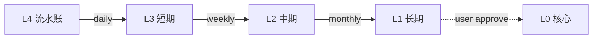

<!-- cortex vault 主页 — HTML 二维全景仪表盘。仅本文件 + 仪表盘/ 用 HTML grid, 其它笔记仍 Markdown。 -->

<div style="display: grid; grid-template-columns: repeat(3, 1fr); gap: 12px; padding: 8px;">

  <section style="border: 1px solid #ddd; border-radius: 8px; padding: 12px;">
    <h3 style="margin-top: 0;">🧠 焦点</h3>
    <p style="color: #666; font-size: 0.9em;">当前 working set</p>
    <ul>
      <li>👉 <a href="焦点.md">打开焦点页</a></li>
    </ul>
  </section>

  <section style="border: 1px solid #ddd; border-radius: 8px; padding: 12px;">
    <h3 style="margin-top: 0;">📚 知识库</h3>
    <p style="color: #666; font-size: 0.9em;">人类组织维度</p>
    <ul>
      <li><a href="知识库/项目/_index.md">项目</a></li>
      <li><a href="知识库/来源/_index.md">来源</a></li>
      <li><a href="知识库/领域/_index.md">领域 (7 大)</a></li>
      <li><a href="知识库/日记/_index.md">日记</a></li>
      <li><a href="知识库/反思/_index.md">反思</a></li>
      <li><a href="知识库/收件箱/_index.md">收件箱</a></li>
    </ul>
  </section>

  <section style="border: 1px solid #ddd; border-radius: 8px; padding: 12px;">
    <h3 style="margin-top: 0;">🤖 记忆体系</h3>
    <p style="color: #666; font-size: 0.9em;">AI URI 寻址 · L0-L4</p>
    <ul>
      <li><a href="记忆体系/L0-核心/_index.md">L0 核心 (不可篡改)</a></li>
      <li><a href="记忆体系/L1-长期/_index.md">L1 长期</a></li>
      <li><a href="记忆体系/L2-中期/_index.md">L2 中期</a></li>
      <li><a href="记忆体系/L3-短期/_index.md">L3 短期</a></li>
      <li><a href="记忆体系/L4-流水账/_index.md">L4 流水账</a></li>
    </ul>
  </section>

  <section style="border: 1px solid #ddd; border-radius: 8px; padding: 12px;">
    <h3 style="margin-top: 0;">📊 仪表盘</h3>
    <p style="color: #666; font-size: 0.9em;">格式化看板</p>
    <ul>
      <li><a href="仪表盘/总览.md">总览</a></li>
      <li><a href="仪表盘/知识库分布.md">知识库分布</a></li>
      <li><a href="仪表盘/记忆-晋级候选.md">晋级候选</a></li>
      <li><a href="仪表盘/记忆-腐化监控.md">腐化监控</a></li>
      <li><a href="仪表盘/固化流.md">固化流</a></li>
    </ul>
  </section>

  <section style="border: 1px solid #ddd; border-radius: 8px; padding: 12px;">
    <h3 style="margin-top: 0;">🔄 固化管道</h3>
    <p style="color: #666; font-size: 0.9em;">L4 → L0</p>



  </section>

  <section style="border: 1px solid #ddd; border-radius: 8px; padding: 12px;">
    <h3 style="margin-top: 0;">⏰ Cron 状态</h3>
    <p style="color: #666; font-size: 0.9em;">9 个周期任务</p>
    <ul>
      <li>详情 → <a href="仪表盘/记忆-cron 状态.md">cron 状态</a></li>
    </ul>
  </section>

</div>

<!-- Bases query 占位 (cortex-dashboard 自动渲染) -->
```bases
# 全局统计 — 由 cortex-dashboard skill 渲染
```
