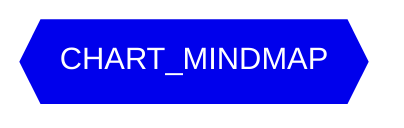

> [!info] 记忆-L2-中期
> 可演化语义记忆 · mindmap 可视, 365 天无召回 → archive

<section data-role="kpi" style="display:grid;grid-template-columns:repeat(4,1fr);gap:8px">
  <div data-type="stat" style="padding:12px;background:#fefce8;border-radius:8px">
    <div style="font-size:12px;color:#666">L2 总计</div>
    <div style="font-size:24px;font-weight:600;color:#ca8a04">{{L2_TOTAL}}</div>
  </div>
  <div data-type="stat" style="padding:12px;background:#f8fafc;border-radius:8px">
    <div style="font-size:12px;color:#666">topic 数</div>
    <div style="font-size:24px;font-weight:600">{{TOPIC_N}}</div>
  </div>
  <div data-type="stat" style="padding:12px;background:#f8fafc;border-radius:8px">
    <div style="font-size:12px;color:#666">将到期 (&lt;30d)</div>
    <div style="font-size:24px;font-weight:600">{{EXPIRING}}</div>
  </div>
  <div data-type="stat" style="padding:12px;background:#f8fafc;border-radius:8px">
    <div style="font-size:12px;color:#666">avg recall</div>
    <div style="font-size:24px;font-weight:600">{{AVG_RECALL}}</div>
  </div>
</section>

## 视图

```base
{{QUERY}}
```

## 语义网络



<details>
<summary>topic 分组</summary>

```mermaid
{{CHART_TOPIC}}
```

</details>

<section data-role="operations" style="display:flex;gap:8px;margin-top:12px">
  <a href="../记忆体系/L2-中期/_index.md">📂 L2 目录</a>
  <a href="记忆-晋级候选.md">🚀 晋级候选</a>
  <a href="../主页.md">⬅ 主页</a>
</section>
