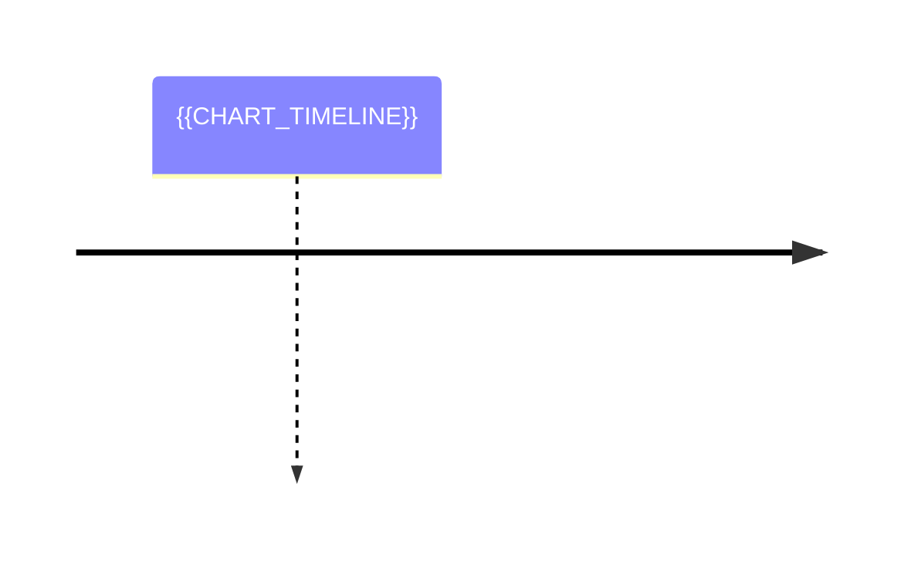

> [!note] 记忆-L3-短期
> 情节记忆时间线 · 90 天后未召回则归档

<section data-role="kpi" style="display:grid;grid-template-columns:repeat(4,1fr);gap:8px">
  <div data-type="stat" style="padding:12px;background:#f0fdf4;border-radius:8px">
    <div style="font-size:12px;color:#666">L3 总计</div>
    <div style="font-size:24px;font-weight:600;color:#16a34a">{{L3_TOTAL}}</div>
  </div>
  <div data-type="stat" style="padding:12px;background:#f8fafc;border-radius:8px">
    <div style="font-size:12px;color:#666">近 7 天</div>
    <div style="font-size:24px;font-weight:600">{{WEEK_N}}</div>
  </div>
  <div data-type="stat" style="padding:12px;background:#f8fafc;border-radius:8px">
    <div style="font-size:12px;color:#666">将到期 (&lt;15d)</div>
    <div style="font-size:24px;font-weight:600">{{EXPIRING}}</div>
  </div>
  <div data-type="stat" style="padding:12px;background:#f8fafc;border-radius:8px">
    <div style="font-size:12px;color:#666">已晋级 L2</div>
    <div style="font-size:24px;font-weight:600">{{PROMOTED}}</div>
  </div>
</section>

## 视图

```base
{{QUERY}}
```

## 时间线



<details>
<summary>按日期分组</summary>

```mermaid
{{CHART_DAILY}}
```

</details>

<section data-role="operations" style="display:flex;gap:8px;margin-top:12px">
  <a href="../记忆体系/L3-短期/_index.md">📂 L3 目录</a>
  <a href="记忆-晋级候选.md">🚀 晋级候选</a>
  <a href="../主页.md">⬅ 主页</a>
</section>
