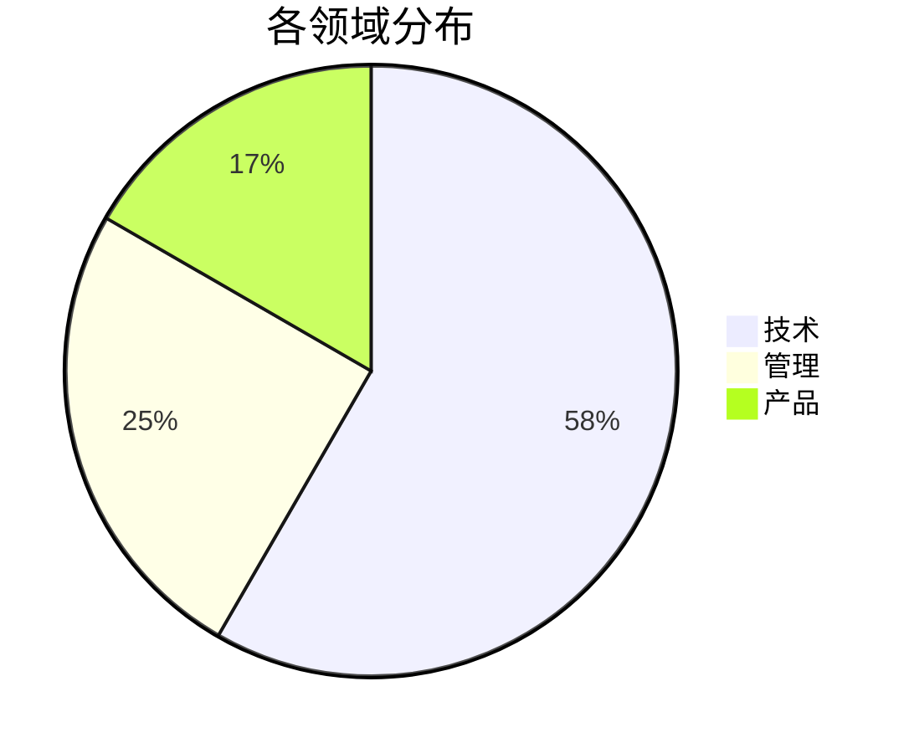
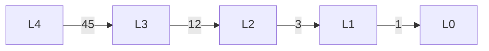
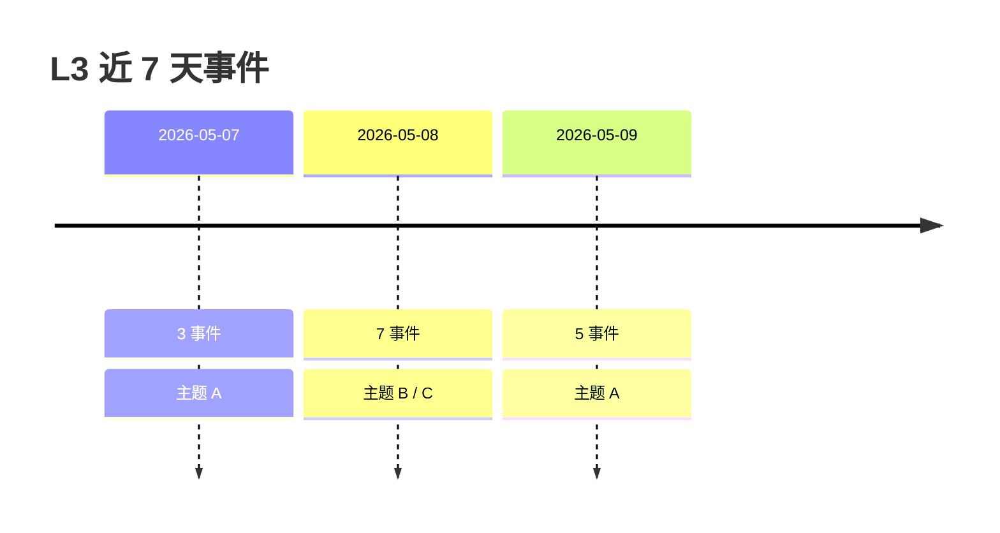
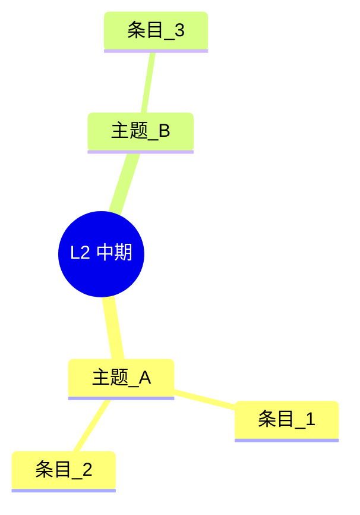

# cortex-dashboard

读 `仪表盘/<page>.md` frontmatter 内 `view_query` (dict) → 按 `kind` 走对应 Bash 数据查询 → 按 `view_chart` 渲染 (KPI callout + chart + Top-N table + Legend) → 注入 `<!-- DASH:BEGIN -->...<!-- DASH:END -->` 区。不动正文与 frontmatter 其余字段。

**单一真相**: 本 SKILL.md 是 cron + slash command 的唯一执行规范。`scripts/cron/dashboard.sh` 与 `commands/dashboard.md` 只做 thin 委托。

## 触发场景
- daily cron `dashboard.sh` (02:30)
- 用户显式 "build dashboard" / "刷新仪表盘" / "/cortex:dashboard"
- cortex-cartographer agent 调用

## 输入 (frontmatter 解析)

每页 `仪表盘/<page>.md` frontmatter 必含:

| 字段 | 类型 | 说明 |
|------|------|------|
| `view_query` | dict | `{kind: <enum>, level?: <L0-L4>, limit?: <int>, window?: <30d/7d/all>}` |
| `view_chart` | enum | `pie / sankey / heatmap / timeline / mindmap / table / grid` |
| `view_kpi` | list | `[{name: <str>, source: <bash-expr>}]`, ≥1 ≤6 |
| `view_legend` | str | 图表说明 + 触发刷新命令 |
| `view_stale_after` | int | 小时 (默认 24); now - rendered_at < stale → skip |

`view_query.kind` 8 个枚举: `memory / knowledge / ledger / cron / bridge / distribution / promotion / warden`。

CLI 参数:
- `path`: 仪表盘 md 路径; 默认全扫 `仪表盘/*.md`
- `--dry-run`: 仅打印, 不写盘
- `--force`: 忽略 stale_after, 强制重渲

## 流程

1. **扫目标**: path 指定→单页; 默认 → `Glob "仪表盘/*.md"` (cap 20)
2. **读 frontmatter**: Read offset=1 limit=60, 解 yaml → 提取 view_query/view_chart/view_kpi/view_legend/view_stale_after
3. **stale 判定**: 找 DASH:BEGIN 行 `rendered_at=<ISO>`, now - rendered_at < view_stale_after → skip (--force 跳过此判定)
4. **数据查询**: 按 view_query.kind 走下文 "## 数据源查询" 章节对应 Bash
5. **数据源不存在判定**:
   - 路径不存在 (e.g. `记忆/views/warden.jsonl` 缺) → 该 dashboard 报 error 加入汇总 JSON `errors[]`, **不写 DASH 区**, 保留上次渲染, continue
   - 路径存在但内容空 → 计数为 `0` (真实数据), **正常渲染**
   - **严禁** `N/A` / `—` / "暂无数据" 占位
6. **渲染**: 按 view_chart 拼 chart 块 (见 "## 图表渲染规则") + KPI callout + Top-N 表 + Legend, 整体封闭在 DASH:BEGIN/END
7. **注入**: 找 DASH:BEGIN..DASH:END 区整段替换; 不存在→文件末追加。区头注释 `<!-- DASH:BEGIN rendered_at=<ISO> query_hash=<sha-8> -->`
8. **输出**: 单行 JSON `{refreshed: [...], skipped: M, errors: [{path, reason}]}`

## 数据源查询

每 kind 用真实 Bash 查, 严禁占位。VAULT 为 vault 根绝对路径。

### kind=memory

`view_query.level` 必须 (L0-L4)。

```bash
# 总数
total=$(find "$VAULT/记忆/<level>-"* -name "*.md" -type f 2>/dev/null | wc -l | tr -d ' ')
# 本周新增 (mtime<7d)
weekly=$(find "$VAULT/记忆/<level>-"* -name "*.md" -type f -mtime -7 2>/dev/null | wc -l | tr -d ' ')
# 过期 (mtime>30d)
stale=$(find "$VAULT/记忆/<level>-"* -name "*.md" -type f -mtime +30 2>/dev/null | wc -l | tr -d ' ')
# Top-N by weight: 复用现有 memory.sh recall
bash ~/.cortex/scripts/memory.sh recall --query "" --levels <level> --top-k 10 --format json
```

路径 `$VAULT/记忆/<level>-*` 不存在 → error, 跳过该 dashboard。

### kind=knowledge

```bash
total=$(find "$VAULT/知识库" -name "*.md" -type f 2>/dev/null | wc -l | tr -d ' ')
# Top-N 复用 search.sh:
bash ~/.cortex/scripts/search.sh --query "" --scope knowledge --top-k 10 --format json
```

### kind=ledger

`view_query.level` 通常 L4。

```bash
# L4 sessions 总数 (jsonl 行数和)
total=$(find "$VAULT/记忆/L4-流水账/sessions" -name "*.jsonl" 2>/dev/null -exec wc -l {} + | tail -1 | awk '{print $1}')
# 30d 内 sessions:
recent=$(find "$VAULT/记忆/L4-流水账/sessions" -name "*.jsonl" -mtime -30 2>/dev/null | wc -l | tr -d ' ')
# 按日聚合 (heatmap 数据):
find "$VAULT/记忆/L4-流水账/sessions" -name "*.jsonl" -mtime -30 2>/dev/null -printf "%TY-%Tm-%Td\n" | sort | uniq -c
```

### kind=cron

```bash
# 9 job 状态:
for f in ~/.cache/cortex/cron/*.json; do
  [ -f "$f" ] && jq -r '"\(.job)|\(.last_run)|\(.duration_sec)|\(.exit_code)"' "$f"
done
# 成功 24h 内:
ok=$(for f in ~/.cache/cortex/cron/*.json; do
  jq -r 'select(.exit_code==0) | .last_run' "$f" 2>/dev/null
done | wc -l | tr -d ' ')
```

`~/.cache/cortex/cron/` 不存在 → error。

### kind=bridge

```bash
# 记忆→知识库 ref:
m2k=$(rg "^ref:" "$VAULT/记忆" --no-heading -c 2>/dev/null | wc -l | tr -d ' ')
# 知识库→记忆 ref:
k2m=$(rg "^ref:" "$VAULT/知识库" --no-heading -c 2>/dev/null | wc -l | tr -d ' ')
# 双向 (启用 jq aggregate):
rg "^ref:" "$VAULT/记忆" "$VAULT/知识库" --json 2>/dev/null | \
  jq -s 'group_by(.data.path.text) | map({path:.[0].data.path.text, refs:length})'
```

### kind=distribution

```bash
# 各领域计数:
for d in "$VAULT"/知识库/领域/*/; do
  name=$(basename "$d")
  cnt=$(find "$d" -name "*.md" -type f | wc -l | tr -d ' ')
  echo "$name:$cnt"
done
# 月增量:
for d in "$VAULT"/知识库/领域/*/; do
  name=$(basename "$d")
  cnt=$(find "$d" -name "*.md" -type f -mtime -30 | wc -l | tr -d ' ')
  echo "$name:$cnt"
done
```

### kind=promotion

```bash
PROM="$VAULT/记忆/views/promotion.jsonl"
[ -f "$PROM" ] || exit_error  # 该 dashboard 报 error, 不写 DASH
# 流量聚合 (from_level → to_level):
jq -s 'group_by(.from_level + "→" + .to_level) | map({pair:.[0].from_level+"→"+.[0].to_level, n:length})' "$PROM"
# 候选总数 (candidates.md):
[ -f "$VAULT/记忆/views/candidates.md" ] && grep -c "^|" "$VAULT/记忆/views/candidates.md"
```

### kind=warden

```bash
WARDEN="$VAULT/记忆/views/warden.jsonl"
[ -f "$WARDEN" ] || exit_error  # 该 dashboard 报 error, 不写 DASH
# 待审条目:
pending=$(jq -s '[.[] | select(.status=="pending")] | length' "$WARDEN")
# kind 分布 (hallucination / drift):
jq -s 'group_by(.kind) | map({kind:.[0].kind, n:length})' "$WARDEN"
```

## 图表渲染规则

每 chart 一段 mermaid 模板; 不支持原生 mermaid 类型时退到固定 fallback。

### view_chart=pie



### view_chart=sankey

Obsidian 原生 mermaid 不支持 sankey, 固定 fallback 为 `flowchart LR`, edge label 写流量:



### view_chart=heatmap

mermaid 无原生 heatmap, 固定 fallback 为 markdown table + emoji 色块:

```markdown
| 周\日 | 一 | 二 | 三 | 四 | 五 | 六 | 日 |
|------|----|----|----|----|----|----|----|
| W18 | 🟩 1 | 🟨 4 | 🟧 7 | 🟥 12 | 🟨 5 | 🟩 2 | 🟩 0 |
| W19 | 🟩 0 | 🟩 2 | 🟨 3 | 🟨 4 | 🟧 8 | 🟩 1 | 🟩 0 |
```

emoji 阈值: 🟩 0-2 / 🟨 3-5 / 🟧 6-10 / 🟥 >10。

### view_chart=timeline



### view_chart=mindmap



### view_chart=table

纯 markdown table:

```markdown
| 标题 | 路径 | weight | 更新 |
|------|------|--------|------|
| 示例 | [[记忆/L1-长期/示例]] | 0.85 | 2026-05-12 |
```

### view_chart=grid

HTML 4 列网格 (KPI 卡片密集展示):

```html
<table>
  <tr>
    <td><b>知识库总数</b><br/>234</td>
    <td><b>记忆总数</b><br/>89</td>
    <td><b>本周新增</b><br/>12</td>
    <td><b>cron 健康</b><br/>9/9</td>
  </tr>
</table>
```

## DASH 区注入结构

完整 DASH:BEGIN/END 内容:

```markdown
<!-- DASH:BEGIN rendered_at=2026-05-13T03:00:00Z query_hash=abc12345 -->

> [!stats] 概览
> **<kpi[0].name>** <val> · **<kpi[1].name>** <val> · **<kpi[2].name>** <val> · **<kpi[3].name>** <val>

### 趋势

<chart-block (mermaid / markdown table / HTML grid)>

### Top 条目

| 标题 | 路径 | weight | 更新 |
|------|------|--------|------|
| ... | [[...]] | 0.85 | 2026-05-12 |

<!-- DASH:LEGEND -->
> [!note] 怎么读
> <view_legend 内容>
>
> 刷新: `bash ~/.cortex/scripts/dashboard.sh` 或 `/cortex:dashboard`

<!-- DASH:END -->
```

**结构强约束**: KPI callout → chart → Top-N table → LEGEND callout 四段, 顺序固定。

`query_hash`: 对 `view_query` dict yaml 化后取 sha256 前 8 位, 用于跳过判定。

## AUTO_MODE 流程 (cron 入口)

`[AUTO_MODE persistent]` 无交互:

1. `Glob "仪表盘/*.md"` (cap 20)
2. 逐页处理:
   a. Read offset=1 limit=60, 解 frontmatter
   b. 缺 view_query / 不是 dict → errors[], skip
   c. 检 DASH:BEGIN rendered_at, < stale_after 且非 --force → skipped++
   d. 按 view_query.kind 跑数据源 Bash (上文 8 段)
   e. 数据源路径不存在 → errors[], 不写盘, continue
   f. 渲染 KPI callout + chart + Top-N table + LEGEND → 拼 DASH 区字符串
   g. Edit 替换 DASH:BEGIN..DASH:END 整段 (含区头 rendered_at + query_hash 注释更新)
3. 输出汇总 JSON

**禁**:
- 读 vault 外文件 (~/.cache/cortex/ 例外, 仅 cron kind)
- 读 vault 内任何 .jsonl / .md 全文 (除 frontmatter 前 60 行)
- AskUserQuestion / 中止任何 dashboard 处理
- `N/A` / `—` / "暂无数据" / 占位符

## 输出

```
[dashboard] scan 12 pages
  ✅ 仪表盘/总览.md (rendered, 1.4 KB)
  ⏭️  仪表盘/知识库分布.md (fresh, skipped)
  ❌ 仪表盘/记忆-腐化监控.md (error: 记忆/views/warden.jsonl 不存在)
  ...
{"refreshed": 9, "skipped": 2, "errors": [{"path": "仪表盘/记忆-腐化监控.md", "reason": "记忆/views/warden.jsonl 不存在"}]}
```

JSON 字段:
- `refreshed`: 成功渲染并写盘的路径列表
- `skipped`: 因 stale 跳过的数量 (int)
- `errors`: `[{path, reason}]` 列表

## 错误处理
- frontmatter 缺 view_query → errors[], continue
- view_query.kind 不在 8 枚举 → errors[], continue
- 数据源路径不存在 → errors[], **不写 DASH 区** (保留上次渲染), continue
- 数据源存在但内容空 → 计数 0, 正常渲染 (0 是真实数据)
- 单页渲染异常 → errors[], 不影响后续页
