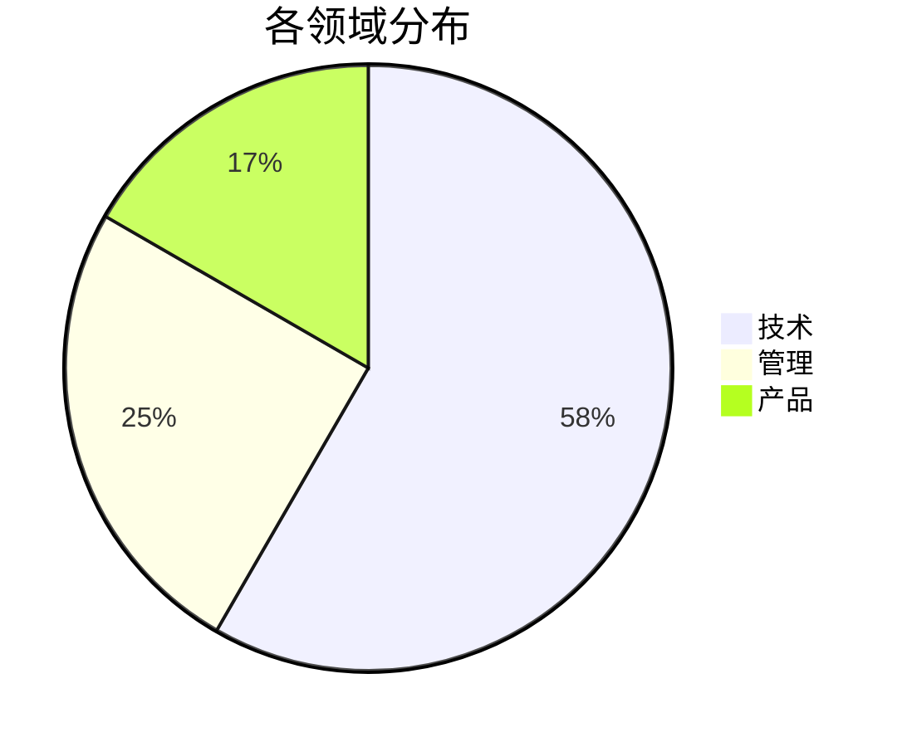
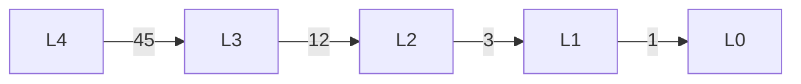
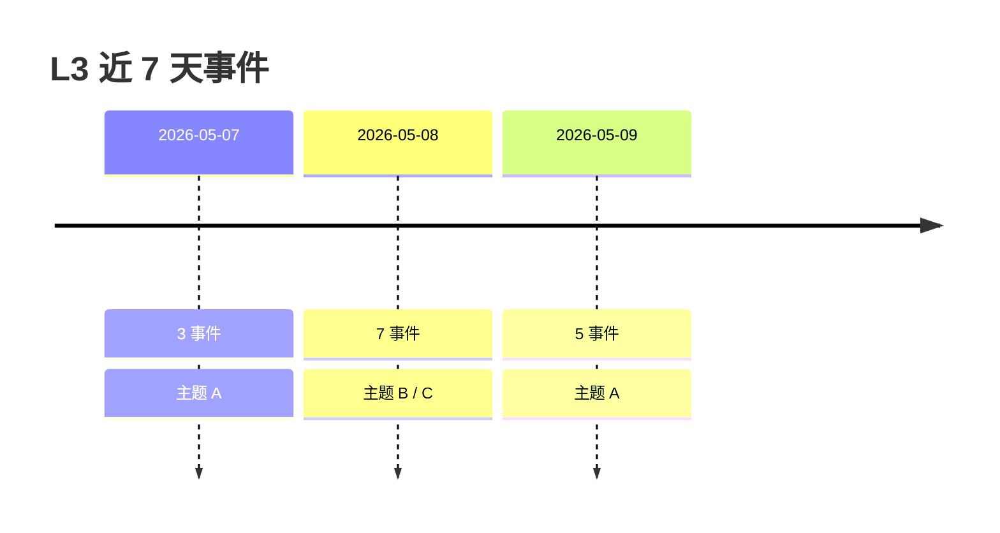
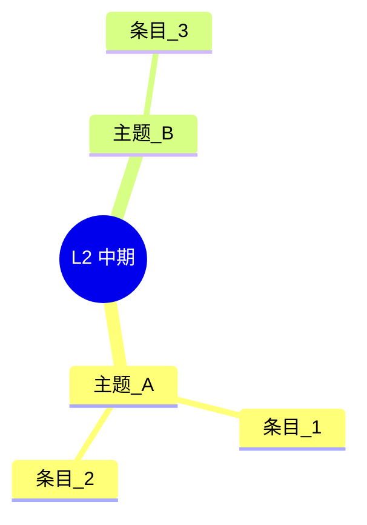

# cortex-dashboard — 图表渲染模板 (7 种)

每 chart 一段 mermaid 模板; Obsidian 原生 mermaid 不支持时退到固定 fallback。

## view_chart=pie



## view_chart=sankey

Obsidian 原生 mermaid 不支持 sankey, 固定 fallback `flowchart LR`, edge label 写流量:



## view_chart=heatmap

mermaid 无原生 heatmap, fallback markdown table + emoji 色块:

```markdown
| 周\日 | 一 | 二 | 三 | 四 | 五 | 六 | 日 |
|------|----|----|----|----|----|----|----|
| W18 | 🟩 1 | 🟨 4 | 🟧 7 | 🟥 12 | 🟨 5 | 🟩 2 | 🟩 0 |
| W19 | 🟩 0 | 🟩 2 | 🟨 3 | 🟨 4 | 🟧 8 | 🟩 1 | 🟩 0 |
```

emoji 阈值: 🟩 0-2 / 🟨 3-5 / 🟧 6-10 / 🟥 >10。

## view_chart=timeline



## view_chart=mindmap



## view_chart=table

纯 markdown table:

```markdown
| 标题 | 路径 | weight | 更新 |
|------|------|--------|------|
| 示例 | [[记忆/L1-长期/示例]] | 0.85 | 2026-05-12 |
```

## view_chart=grid

HTML 4 列网格 (KPI 卡片密集展示):

```html
<table>
  <tr>
    <td><b>知识库总数</b><br/>234</td>
    <td><b>记忆总数</b><br/>89</td>
    <td><b>本周新增</b><br/>12</td>
    <td><b>cron 健康</b><br/>9/9</td>
  </tr>
</table>
```
